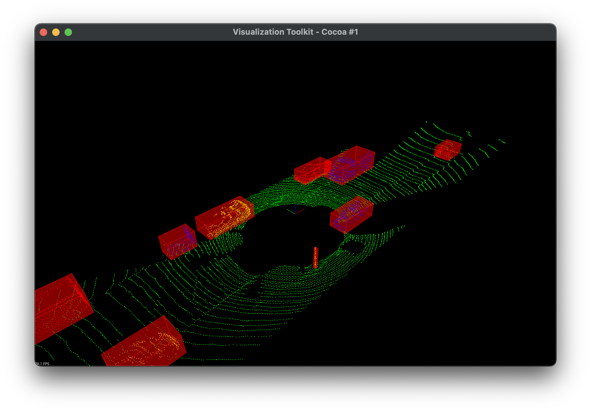

# Lidar Obstacle Detection
filter, segment, and cluster real-point cloud data to detect obstacles in a driving environment.

https://github.com/mohamedmajdi/Lidar-Obstacle-Detection/assets/69417860/98c273b2-a328-4a1b-aa50-16ae10155f27

# Work done using C++ Language
1. Creating Lidar rays in simulation & rendering point cloud data
2. 3D RANSAC segmentation of point cloud data
3. Implementing Euclidean clustering with KD-Tree
4. creating 3D bounding boxes around detected objects
